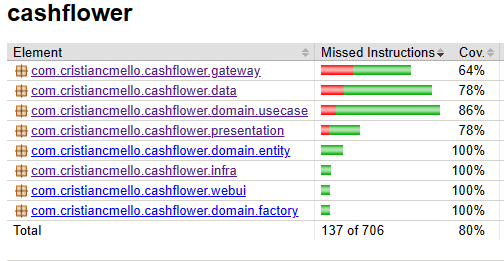

# CashFlower

Um App de Gerenciamento de Fluxo de Caixa.

Tecnologias utilizadas:

* Spring Boot 3
* Apache Maven 3
* Docker Engine v23.0
* Banco de Dados H2 (SQL, Persistência em RAM para demonstração)

Foi adotado o **Clean Architecture** como *Padrão Arquitetural* e abordagem de deployment baseado em **microsserviços**.

## Build

```sh
mvn clean install
```

## Testing

```sh
mvn clean verify
```

* Cobertura aceita de 80%



## Containers

* Existem dois projetos a serem construídos:
  - Serviço **CashFlower** responsável pelos lançamentos de crédito e débito
  - Serviço **ConsolidadoDiario** responsável pelo relatório de fluxo de caixa diário

### Build & Running

```sh
# Clone o repositório do servico consolidadodiario
git clone https://github.com/cristiancmello/consolidadodiario

# Suba a Stack com servicos do CashFlower e ConsolidadoDiario
docker-compose up -d
```

### Testando APIs (com cURL)

* Lançamento de Crédito

```sh
curl -X POST \
  --url http://localhost:8080/lancamento/credito \
  --header 'Content-Type: application/json' \
  --data '{"valor": "300.00"}'
  
# Exemplo de saida
{"mensagem":"Lancado com sucesso!","dataEHoraLancamento":"2023-06-05T04:49:31.579075847"}
```

* Lançamento de Débito

```sh
curl -X POST \
  --url http://localhost:8080/lancamento/debito \
  --header 'Content-Type: application/json' \
  --data '{"valor": "100.0"}'
  
# Exemplo de saida
{"mensagem":"Lancado com sucesso!","dataEHoraLancamento":"2023-06-05T04:51:20.972471983"}
```

* Consolidado Diário

```sh
curl -X GET \
  --url 'http://localhost:8081/consolidado-diario?data=2023-06-05' \
  --header 'Content-Type: application/json'
  
# Exemplo de saida
{"mensagem":"No dia Jun 5, 2023 seu saldo foi de R$ 2900.00"}
```

* Logs de execução via Docker Desktop


